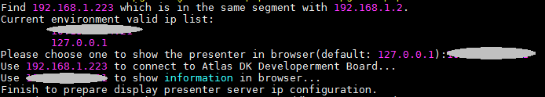
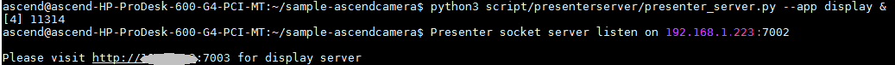
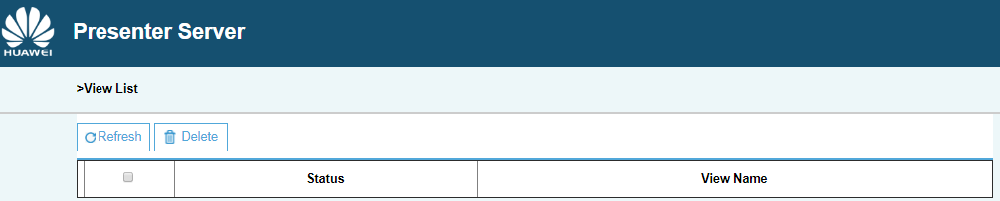
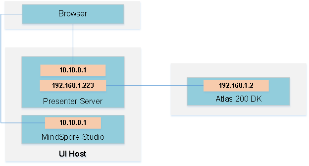

中文|[英文](README.md)

Ascendcamera主要功能是通过Atlas 200 DK开发者板上的摄像头采集数据，经过DVPP转换为jpg，最终保存为文件或者远程输出。

## 前提条件<a name="zh-cn_topic_0167333823_section137245294533"></a>

部署此Sample前，需要准备好以下环境：

-   已完成MindSpore Studio的安装。
-   已完成Atlas 200 DK开发者板与MindSpore Studio的连接，交叉编译器的安装，SD卡的制作及基本信息的配置等。

## 软件准备<a name="zh-cn_topic_0167333823_section8534138124114"></a>

运行此Sample前，需要按照此章节获取源码包，并进行相关的环境配置。

1.  获取源码包。

    将[https://github.com/Atlas200dk/sample-ascendcamera](https://github.com/Atlas200dk/sample-ascendcamera)仓中的代码以MindSpore Studio安装用户下载至MindSpore Studio所在Ubuntu服务器的任意目录，例如代码存放路径为：$HOME/sample-ascendcamera。

2.  以MindSpore Studio安装用户登录MindSpore Studio所在Ubuntu服务器，并设置环境变量DDK\_HOME。

    **vim \~/.bashrc**

    执行如下命令在最后一行添加DDK\_HOME及LD\_LIBRARY\_PATH的环境变量。

    **export DDK\_HOME=$HOME/tools/che/ddk/ddk**

    **export LD\_LIBRARY\_PATH=$DDK\_HOME/uihost/lib**

    > **说明：**    
    >-   如果此环境变量已经添加，则此步骤可跳过。  

    输入:wq!保存退出。

    执行如下命令使环境变量生效。

    **source \~/.bashrc**


## 部署<a name="zh-cn_topic_0167333823_section11947911019"></a>

1.  以MindSpore Studio安装用户进入ascendcamera应用代码所在根目录，如“$HOME/sample-ascendcamera“。
2.  执行部署脚本，进行工程环境准备，包括ascenddk公共库的编译与部署、网络模型的下载、Presenter Server服务器的配置等操作，其中Presenter Server用于接收Application发送过来的数据并通过浏览器进行结果展示。

    **bash deploy.sh** _host\_ip_ _model\_mode_

    -   _host\_ip_：Atlas 200 DK开发者板的IP地址。
    -   model\_mode代表模型文件及依赖软件的部署方式，默认为internet。
        -   local：若MindSpore Studio所在Ubuntu系统未连接网络，请使用local模式，执行此命令前，需要参考[公共代码库下载](#zh-cn_topic_0167333823_section4995103618210)将依赖的公共代码库下载到“sample-ascendcamera/script“目录下。
        -   internet：若MindSpore Studio所在Ubuntu系统已连接网络，请使用internet模式，在线下载依赖代码库。


    命令示例：

    **bash deploy.sh 192.168.1.2 internet**

    当提示“Please choose one to show the presenter in browser\(default: 127.0.0.1\):“时，请输入在浏览器中访问Presenter Server服务所使用的IP地址（一般为访问MindSpore Studio的IP地址。）

    如[图1](#zh-cn_topic_0167333823_fig184321447181017)所示，请在“Current environment valid ip list“中选择通过浏览器访问Presenter Server服务使用的IP地址。

    **图 1**  工程部署示意图<a name="zh-cn_topic_0167333823_fig184321447181017"></a>  
    

3.  <a name="zh-cn_topic_0167333823_li08019112542"></a>启动Presenter Server。

    执行如下命令在后台启动Ascend Camera应用的Presenter Server主程序。

    **python3 script/presenterserver/presenter\_server.py --app display &**

    > **说明：**   
    >“presenter\_server.py“在当前目录的“script/presenterserver“目录下，可以在此目录下执行**python3 presenter\_server.py -h**或者**python3 presenter\_server.py --help**查看“presenter\_server.py“的使用方法。  

    如[图2](#zh-cn_topic_0167333823_fig69531305324)所示，表示presenter\_server的服务启动成功。

    **图 2**  Presenter Server进程启动<a name="zh-cn_topic_0167333823_fig69531305324"></a>  
    

    使用上图提示的URL登录Presenter Server，IP地址为[2](#zh-cn_topic_0167333823_li08019112542)中输入的IP地址，端口号默为7003，如下图所示，表示Presenter Server启动成功。

    **图 3**  主页显示<a name="zh-cn_topic_0167333823_fig64391558352"></a>  
    

    Presenter Server、MindSpore Studio与Atlas 200 DK之间通信使用的IP地址示例如下图所示：

     **图 4**  IP地址示例<a name="zh-cn_topic_0167333823_fig64391558353"></a>  
    

    其中：
    - Atlas 200 DK开发者板使用的IP地址为192.168.1.2（USB方式连接）。
    - Presenter Server与Atlas 200 DK通信的IP地址为UI Host服务器中与Atlas 200 DK在同一网段的IP地址，例如：192.168.1.223。
    - 通过浏览器访问Presenter Server的IP地址本示例为：10.10.0.1，由于Presenter Server与MindSpore Studio部署在同一服务器，此IP地址也为通过浏览器访问MindSpre Studio的IP。


## 媒体信息离线保存<a name="zh-cn_topic_0167333823_section16681395119"></a>

1.  在MindSpore Studio所在Ubuntu服务器中，以HwHiAiUser用户SSH登录到开发者板。

    **ssh HwHiAiUser@192.168.1.2**

2.  进入Ascendcamera的可执行文件所在路径。

    **cd \~/HIAI\_PROJECTS/ascend\_workspace/ascendcamera/out**

3.  执行ascendcamera命令进行媒体信息离线保存。
    
    从摄像头获取图片并保存为jpg文件，如果已经存在同名文件则覆盖。

    **./ascendcamera -i -c 1 -o   _/localDirectory/filename.jpg_  --overwrite**

    -   -i：代表获取jpg格式的图片。
    -   -c：表示摄像头所在的channel，此参数有“0”和“1”两个选项，“0“对应“Camera1“，“1“对应“Camera2“，如果不填写，默认为“0”。
    -   -o：表示文件存储位置，此处localDirectory为本地已存在的文件夹名称，filename.jpg为保存的图片名称，可用户自定义。

      > **说明：**   
            >此路径HwHiAiUser需要有可读写权限。  

    -   --overwrite：覆盖已存在的同名文件。

    其他详细参数请执行 **./ascendcamera** 命令或者 **./ascendcamera --help** 命令参见帮助信息。


## 通过Presenter Server播放实时视频<a name="zh-cn_topic_0167333823_section20204154716116"></a>

1.  在MindSpore Studio所在Ubuntu服务器中，以HwHiAiUser用户SSH登录到开发者板。

    **ssh HwHiAiUser@192.168.1.2**

2.  进入Ascendcamera的可执行文件所在路径。

    **cd \~/HIAI\_PROJECTS/ascend\_workspace/ascendcamera/out**

3.  执行下命令将通过摄像头捕获的视频传输到Presenter Server。

    **./ascendcamera -v -c  _1_   -t  _60_ **--fps  _20_**  -w  _704_  -h  _576_  -s  _192.168.1.223_:7002/**_**presenter\_view\_app\_name**_

    -   -v：代表获取摄像头的视频，用来在Presenter Server端展示。
    -   -c：表示摄像头所在的channel，此参数有“0”和“1”两个选项，“0“对应“Camera1“，“1“对应“Camera2“，如果不填写，默认为“0”。查询摄像头所属Channel的方法请参考[Atlas 200 DK使用指南](https://ascend.huawei.com/documentation)中的“如何查询摄像头所属Channel”。
    -   -t：表示获取60s的视频文件，如果不指定此参数，则获取视频文件直至程序退出。
    -   --fps：表示存储视频的帧率，取值范围为1\~20，如果不设置此参数，则默认存储的视频帧率为10fps。
    -   -w：表示存储视频的宽。
    -   -h：表示存储视频的高。
    -   -s后面的值 _192.168.1.223_ 为Presenter中7002端口对应的IP地址（如[3](#zh-cn_topic_0167333823_li08019112542)中启动Presenter Server回显显示，即为与Atlas 200 DK开发者板通信的IP地址），7002为Ascendcamera应用对应的Presenter Server服务器的默认端口号。
    -   _presenter\_view\_app\_name_ 为在Presenter Server端展示的“View Name“，用户自定义，需要保持唯一。

    其他详细参数请执行 **./ascendcamera** 命令或者 **./ascendcamera --help** 命令参见帮助信息。

    > **说明：**   
    >-   Ascendcamera的Presenter Server最多支持10路Channel同时显示，每个_presenter\_view\_app\_name_ 对应一路Channel。  
    >-   由于硬件的限制，每一路支持的最大帧率是20fps，受限于网络带宽的影响，帧率会自动适配为较低的帧率进行展示。  


## 后续处理<a name="zh-cn_topic_0167333823_section856641210261"></a>

Presenter Server服务启动后会一直处于运行状态，若想停止Ascendcamera应用对应的Presenter Server服务，可执行如下操作。

以MindSpore Studio安装用户在MindSpore Studio所在服务器中执行如下命令查看Ascendcamera应用对应的Presenter Server服务的进程。

**ps -ef | grep presenter | grep display**

```
ascend@ascend-HP-ProDesk-600-G4-PCI-MT:~/sample-ascendcamera$ ps -ef | grep presenter | grep display
ascend 5758 20313 0 14:28 pts/24?? 00:00:00 python3 presenterserver/presenter_server.py --app display
```

如上所示 _5758_ 即为Ascendcamera应用对应的Presenter Server服务的进程ID。

若想停止此服务，执行如下命令：

**kill -9** _5758_

## 公共代码库下载<a name="zh-cn_topic_0167333823_section4995103618210"></a>

将依赖的软件库下载到“sample-ascendcamera/script“目录下。

**表 1**  依赖代码库下载

<a name="zh-cn_topic_0167333823_table141761431143110"></a>
<table><thead align="left"><tr id="zh-cn_topic_0167333823_row18177103183119"><th class="cellrowborder" valign="top" width="33.33333333333333%" id="mcps1.2.4.1.1"><p id="zh-cn_topic_0167333823_p8177331103112"><a name="zh-cn_topic_0167333823_p8177331103112"></a><a name="zh-cn_topic_0167333823_p8177331103112"></a>模块名称</p>
</th>
<th class="cellrowborder" valign="top" width="33.33333333333333%" id="mcps1.2.4.1.2"><p id="zh-cn_topic_0167333823_p1317753119313"><a name="zh-cn_topic_0167333823_p1317753119313"></a><a name="zh-cn_topic_0167333823_p1317753119313"></a>模块描述</p>
</th>
<th class="cellrowborder" valign="top" width="33.33333333333333%" id="mcps1.2.4.1.3"><p id="zh-cn_topic_0167333823_p1417713111311"><a name="zh-cn_topic_0167333823_p1417713111311"></a><a name="zh-cn_topic_0167333823_p1417713111311"></a>下载地址</p>
</th>
</tr>
</thead>
<tbody><tr id="zh-cn_topic_0167333823_row19177133163116"><td class="cellrowborder" valign="top" width="33.33333333333333%" headers="mcps1.2.4.1.1 "><p id="zh-cn_topic_0167333823_p2017743119318"><a name="zh-cn_topic_0167333823_p2017743119318"></a><a name="zh-cn_topic_0167333823_p2017743119318"></a>EZDVPP</p>
</td>
<td class="cellrowborder" valign="top" width="33.33333333333333%" headers="mcps1.2.4.1.2 "><p id="zh-cn_topic_0167333823_p7177153115317"><a name="zh-cn_topic_0167333823_p7177153115317"></a><a name="zh-cn_topic_0167333823_p7177153115317"></a>对DVPP接口进行了封装，提供对图片/视频的处理能力。</p>
</td>
<td class="cellrowborder" valign="top" width="33.33333333333333%" headers="mcps1.2.4.1.3 "><p id="zh-cn_topic_0167333823_p31774315318"><a name="zh-cn_topic_0167333823_p31774315318"></a><a name="zh-cn_topic_0167333823_p31774315318"></a><a href="https://github.com/Atlas200dk/sdk-ezdvpp" target="_blank" rel="noopener noreferrer">https://github.com/Atlas200dk/sdk-ezdvpp</a></p>
<p id="zh-cn_topic_0167333823_p1634523015710"><a name="zh-cn_topic_0167333823_p1634523015710"></a><a name="zh-cn_topic_0167333823_p1634523015710"></a>下载后请保持文件夹名称为ezdvpp。</p>
</td>
</tr>
<tr id="zh-cn_topic_0167333823_row101773315313"><td class="cellrowborder" valign="top" width="33.33333333333333%" headers="mcps1.2.4.1.1 "><p id="zh-cn_topic_0167333823_p217773153110"><a name="zh-cn_topic_0167333823_p217773153110"></a><a name="zh-cn_topic_0167333823_p217773153110"></a>Presenter Agent</p>
</td>
<td class="cellrowborder" valign="top" width="33.33333333333333%" headers="mcps1.2.4.1.2 "><p id="zh-cn_topic_0167333823_p19431399359"><a name="zh-cn_topic_0167333823_p19431399359"></a><a name="zh-cn_topic_0167333823_p19431399359"></a>与Presenter Server进行交互的API接口。</p>
</td>
<td class="cellrowborder" valign="top" width="33.33333333333333%" headers="mcps1.2.4.1.3 "><p id="zh-cn_topic_0167333823_p16684144715560"><a name="zh-cn_topic_0167333823_p16684144715560"></a><a name="zh-cn_topic_0167333823_p16684144715560"></a><a href="https://github.com/Atlas200dk/sdk-presenter/tree/master" target="_blank" rel="noopener noreferrer">https://github.com/Atlas200dk/sdk-presenter/tree/master</a></p>
<p id="zh-cn_topic_0167333823_p82315442578"><a name="zh-cn_topic_0167333823_p82315442578"></a><a name="zh-cn_topic_0167333823_p82315442578"></a>请获取此路径下的presenteragent文件夹，下载后请保持文件夹名称为<span class="filepath" id="zh-cn_topic_0167333823_filepath541722722118"><a name="zh-cn_topic_0167333823_filepath541722722118"></a><a name="zh-cn_topic_0167333823_filepath541722722118"></a>“presenteragent”</span>。</p>
</td>
</tr>
<tr id="zh-cn_topic_0167333823_row1839610216202"><td class="cellrowborder" valign="top" width="33.33333333333333%" headers="mcps1.2.4.1.1 "><p id="zh-cn_topic_0167333823_p974822982618"><a name="zh-cn_topic_0167333823_p974822982618"></a><a name="zh-cn_topic_0167333823_p974822982618"></a>Presenter Server</p>
</td>
<td class="cellrowborder" valign="top" width="33.33333333333333%" headers="mcps1.2.4.1.2 "><p id="zh-cn_topic_0167333823_p17486293261"><a name="zh-cn_topic_0167333823_p17486293261"></a><a name="zh-cn_topic_0167333823_p17486293261"></a>显示Presenter Agent推送的结果，可以通过浏览器访问。</p>
</td>
<td class="cellrowborder" valign="top" width="33.33333333333333%" headers="mcps1.2.4.1.3 "><p id="zh-cn_topic_0167333823_p18748529102619"><a name="zh-cn_topic_0167333823_p18748529102619"></a><a name="zh-cn_topic_0167333823_p18748529102619"></a><a href="https://github.com/Atlas200dk/sdk-presenter/tree/master" target="_blank" rel="noopener noreferrer">https://github.com/Atlas200dk/sdk-presenter/tree/master</a></p>
<p id="zh-cn_topic_0167333823_p14457641112711"><a name="zh-cn_topic_0167333823_p14457641112711"></a><a name="zh-cn_topic_0167333823_p14457641112711"></a>请获取此路径下的presenterserver文件夹，下载后请保持文件夹名称为 <span class="filepath" id="zh-cn_topic_0167333823_filepath7457144115272"><a name="zh-cn_topic_0167333823_filepath7457144115272"></a><a name="zh-cn_topic_0167333823_filepath7457144115272"></a>“presenterserver”</span>.</p>
</td>
</tr>
<tr id="zh-cn_topic_0167333823_row41448585315"><td class="cellrowborder" valign="top" width="33.33333333333333%" headers="mcps1.2.4.1.1 "><p id="zh-cn_topic_0167333823_p183492409496"><a name="zh-cn_topic_0167333823_p183492409496"></a><a name="zh-cn_topic_0167333823_p183492409496"></a>tornado (5.1.0)</p>
<p id="zh-cn_topic_0167333823_p2086423035111"><a name="zh-cn_topic_0167333823_p2086423035111"></a><a name="zh-cn_topic_0167333823_p2086423035111"></a>protobuf (3.5.1)</p>
<p id="zh-cn_topic_0167333823_p153384713510"><a name="zh-cn_topic_0167333823_p153384713510"></a><a name="zh-cn_topic_0167333823_p153384713510"></a>numpy (1.14.2)</p>
</td>
<td class="cellrowborder" valign="top" width="33.33333333333333%" headers="mcps1.2.4.1.2 "><p id="zh-cn_topic_0167333823_p23491040134916"><a name="zh-cn_topic_0167333823_p23491040134916"></a><a name="zh-cn_topic_0167333823_p23491040134916"></a>Presenter Server依赖的Python库</p>
</td>
<td class="cellrowborder" valign="top" width="33.33333333333333%" headers="mcps1.2.4.1.3 "><p id="zh-cn_topic_0167333823_p234964011491"><a name="zh-cn_topic_0167333823_p234964011491"></a><a name="zh-cn_topic_0167333823_p234964011491"></a>可以在python官网 https://pypi.org/ 上搜索相关包进行安装。若使用pip3 install命令在线下载，可以使用如下命令指定相关版本进行下载，例如：</p><p>pip3 install tornado==5.1.0  -i  指定库的安装源  --trusted-host  安装源的主机名</p>
</td>
</tr>
</tbody>
</table>

