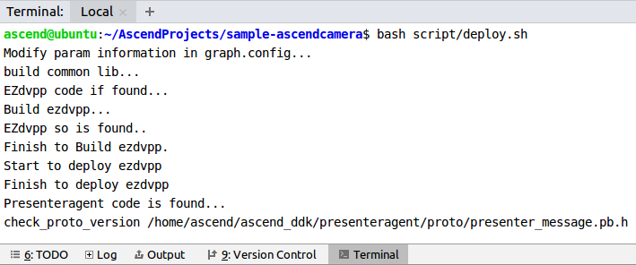
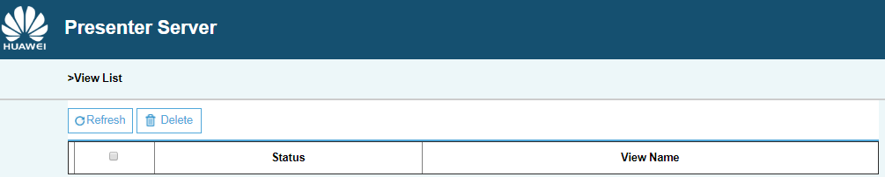

EN|[CN](Readme.md)


# Ascendcamera<a name="ZH-CN_TOPIC_0208833163"></a>

Ascendcamera collects data through the camera on the Atlas 200 DK developer board, converts the data into JPG by using the digital vision pre-processing \(DVPP\) module, and saves the video streams as files or remote output.

## Prerequisites<a name="zh-cn_topic_0203223312_section137245294533"></a>

Before using an open source application, ensure that:

-   Mind Studio has been installed. .
-   The Atlas 200 DK developer board has been connected to Mind Studio, the cross compiler has been installed, the SD card has been prepared, and basic information has been configured. 

## Deployment
1. Deployment: choose either faster deployment or conventional deployment as shown below: 

   1.1 Faster deployment, refer to https://github.com/Atlas200DKTest/faster-deploy.git .
    > **NOTE：**   
    >-   This faster deployment script can quickly deploy multiple cases, select ascendcamera case for this project.
    >-   This faster deployment automatically performs code download, model conversion and environment variable configuration. For details, choose conventional deployment method, as shown in 1.2.
    
   1.2 Conventional deployment, refer to : https://github.com/Atlas200DKTest/sample-README/tree/master/sample-ascendcamera  .
    > **NOTE：**   
    >-   This deployment method requires manually performing code download, model conversion and environment variable configuration. A better understand of the deployment process can be obtained from this method.

## Compile<a name="zh-cn_topic_0203223312_section11947911019"></a>

1.  Open the corresponding project.

    Enter the “**MindStudio-ubuntu/bin**” directory after decompressing the installation package in the command line, for example, **$HOME/MindStudio-ubuntu/bin**. Run the following command to start **Mind Studio**:
    
    **./MindStudio.sh**

    After successfully starting **Mind Studio**, open **sample-ascendcamera**** project，as shown in [Figure 1](#zh-cn_topic_0203223312_fig1696912234714)

    **Figure 1**  Open **sample-camera** project<a name="zh-cn_topic_0203223312_fig1696912234714"></a>  
    

    

2.  Configure related project information in the **src/param\_configure.conf**

    **Figure 2**  Configuration file path<a name="zh-cn_topic_0203223312_fig10430135171116"></a>  
    

    

    The configuration file is as follows:

    ```
    remote_host=
    ```

    Following parameter configuration needs to be added manually：


    -   remote\_host：this parameter indicates the IP address of Atlas 200 DK developer board.

    An example of video file configuration is as follows:
 
     ```
     remote_host=192.168.1.2
     ```

    > **NOTE：**   
    >Note that the "" symbol is no need to be used when filling in parameters.

3.  Run the deployment script to adjust the configuration parameters, download and compile 3rd party libraries. Open the Terminal of **Mind Studio** tool, which is under the main code directory, run the following command to execute environment deployment in the backstage, as shown in [Figure 3](#zh-cn_topic_0182554577_fig19292258105419).
    
    **Figure 3**  Execute deployment script<a name="zh-cn_topic_0182554577_fig19292258105419"></a>  
    
    
    
    > **NOTE：**   
    >-   Automatic download and compilation will perform if 3rd party libraries are not deployed for the first time of deployment. This process might take some time, please wait patiently. It will not download and compilation repeatedly when recompiling later, deployment is shown as above. 
    >-   Select the HOST IP connected to the developer board when deploying, which is usually the IP of virtual network card. If this IP belongs to the same segment as the developer board IP, it will be selected automatically and deployed. Otherwise, manual entering the IP connected to developer board is required for deployment.


3.  Begin to compile, open **Mind Studio** tool, click **Build \> Build \> Build-Configuration** in the toolbar, shown as [Figure 4](#zh-cn_topic_0203223312_fig5350165415161), **build** and **run** folders will be generated under the directory.


    **Figure 4**  Compilation operation and generated files<a name="zh-cn_topic_0203223312_fig5350165415161"></a>  
    

    

    > **NOTE：**   
    >When you compile the project for the first time, **Build \> Build** is gray and not clickable. Your need to click **Build \> Edit Build Configuration**, configure the compilation parameters and then compile.  
    >  

4.  <a name="zh-cn_topic_0203223312_li043217442034"></a>Start Presenter Server.

     Open **Terminal** of **Mind Studio** tool, it is in the path where code saved in [Step 1](#zh-cn_topic_0203223312_li953280133816) by default, run the following command to start the **Presenter Server** main program of the **Video Analysiscar**application, as shown in [Figure 5](#zh-cn_topic_0203223312_fig815812478221).

    **bash run\_present\_server.sh**

    **Figure 5**  Start PresenterServer<a name="zh-cn_topic_0203223312_fig815812478221"></a>  
    

    

    -   When the message "Please choose one to show the presenter in browser (default: 127.0.0.1):" is displayed, enter the IP address used for accessing the **Presenter Server** service in the browser. Generally, the IP address is the IP address for accessing the **Mind Studio** service.

    As shown in [Figure 6](#zh-cn_topic_0203223312_fig20890201582816), Select the IP address used by the browser to access the **Presenter Server** service in "Current environment valid ip list" and enter the path for storing video analysis data.

    **Figure 6**  Project deployment<a name="zh-cn_topic_0203223312_fig20890201582816"></a>  
    

    

     As shown in [Figure 7](#zh-cn_topic_0203223312_fig143112216312) it means **presenter\_server**  service starts successfully.

    **Figure 7**  Starting the Presenter Server process<a name="zh-cn_topic_0203223312_fig143112216312"></a>  
    

    

     Use the URL shown in the preceding figure to log in to **Presenter Server** (only the Chrome browser is supported). The IP address is that entered in [Figure 6](#zh-cn_topic_0203223312_fig20890201582816) and the default port number is 7003. The following figure indicates that Presenter Server is started successfully.

    **Figure 8**  Home page<a name="zh-cn_topic_0203223312_fig3338812171913"></a>  
    

    The following figure shows the IP address used by the **Presenter Server** and **Mind Studio** to communicate with the Atlas 200 DK.

    **Figure 9**  Example IP Address<a name="zh-cn_topic_0203223312_fig633991291914"></a>  
    

    -   The IP address of the Atlas 200 DK developer board is 192.168.1.2 (connected in USB mode).
    -   The IP address used by the **Presenter Server** to communicate with the Atlas 200 DK is in the same network segment as the IP address of the Atlas 200 DK on the UI Host server. For example: 192.168.1.223.
    -   The following is an example of accessing the IP address of the **Presenter Server** using a browser: 10.10.0.1, because the Presenter Server and **Mind Studio** are deployed on the same server, the IP address is also the IP address for accessing the Mind Studio through the browser.


## Running<a name="zh-cn_topic_0203223312_section123001119164920"></a>

Run the Ascend Camera application.

Find **Run** button in the toolbar of **Mind Studio** tool, click **Run \> Run 'sample-ascendcamera'**, run the program on the developer board, as shown in [Figure 10](#zh-cn_topic_0203223312_fig19482184244914).

**Figure 10**  Program execution<a name="zh-cn_topic_0203223312_fig19482184244914"></a>  


> **NOTE：**   
>Please ignore the above error, because IDE cannot pass parameters for executable programs. The above steps are to deploy the executable program and the dependent library files to the developer board. This step requires to log in to developer board in SSH mode to the corresponding directory file and execute manually. For details, refer to the following steps.

## Saving Media Information Offline<a name="zh-cn_topic_0203223312_section16681395119"></a>

1.  Log in to the Atlas DK developer board as the  **HwHiAiUser**  user in SSH mode on Ubuntu Server where **Mind Studio** is located.

    **ssh HwHiAiUser@192.168.1.2**

    For the Atlas 200 DK, the default value of host_ip is 192.168.1.2 (USB connection mode) or 192.168.0.2 (NIC connection mode).

    For  AI acceleration cloud server, **host\_ip** indicates  the IP address of the server where **Mind Studio** is currently located.
    
2.  Go to the path of the executable file of Ascend camera, run the following command.

    **cd \~/HIAI\_PROJECTS/workspace\_mind\_studio/sample\_ascendcamera\_5b4f8b24/out**

3.  Run **workspace\_mind\_studio\_sample\_ascendcamera** command to save media information offline.

    Obtain the image from the camera and save it as a **.jpg** file. If a file with the same name already exists, it will be overwritten. 
    
    **./** **workspace\_mind\_studio\_sample\_ascendcamera-i -c 1 -o   _/localDirectory/filename.jpg_  --overwrite**

    -   **-i**: Indicates that a JPG image is obtained.
    -   **-c**: Indicates the channel to which a camera belongs to. This parameter can be set to  **0**  or  **1**. The value  **0**  corresponds to  **Camera1**, and the value  **1**  corresponds to  **Camera2**. If this parameter is not set, the default value  **0**  is used. For details, see  **View the Channel to Which a Camera Belongs** of [Atlas 200 DK User Guide](https://ascend.huawei.com/doc).
    -   **-o**: Indicates the file storage location.  **localDirectory**  is the name of a local folder.  **filename.jpg**  is the name of a saved image, which can be user-defined.

        > **NOTE：**   
        >The  **HwHiAiUser**  user must have the read and write permissions on the path.  
        
    -   **--overwrite**：Overwrites the existing file with the same name.

    For other parameters, run the **./** **workspace\_mind\_studio\_sample\_ascendcamera**command or the **./** **workspace\_mind\_studio\_sample\_ascendcamera --help**  command. For details, see the help information.


## Playing a Real-Time Video Through Presenter Server<a name="zh-cn_topic_0203223312_section20204154716116"></a>

1.  Log in to the Atlas DK developer board as the  **HwHiAiUser**  user in SSH mode on Ubuntu Server where **Mind Studio** is located.

    **ssh HwHiAiUser@192.168.1.2**

2.  Go to the path of the executable file of Ascend camera, run the following command.

    **cd \~/HIAI\_PROJECTS/workspace\_mind\_studio/sample\_ascendcamera\_5b4f8b24/out**

3.  Run the following command to transmit the video captured by the camera to **Presenter Server**:

    **./workspace\_mind\_studio\_sample\_ascendcamera -v -c  _1_   -t  _60_ **--fps  _20_**  -w  _704_  -h  _576_  -s  _192.168.1.223_:7002/**_**presenter\_view\_app\_name**_

    -   **-v**: Indicates that the video of the camera is obtained and displayed on the **Presenter Server**.
    -   **-c**: Indicates the channel to which a camera belongs to. This parameter can be set to  **0**  or  **1**. The value  **0**  corresponds to  **Camera1**  in, and the value  **1**  corresponds to  **Camera2**  in. If this parameter is not set, the default value  **0**  is used. For details, see  **View the Channel to Which a Camera Belongs** of [Atlas 200 DK User Guide](https://ascend.huawei.com/documentation).
    -   **-t**: Indicates that a video file lasting 60 seconds is obtained. If this parameter is not specified, the video file is obtained until the application exits.
    -   **--fps**: Indicates the frame rate of a saved video. The value range is 1\~20. The default video frame rate is 10 fps.
    -   **-w**: Indicates the width of a saved video.
    -   **-h**: Indicates the height of a saved video.
    -   **_192.168.1.223_** behind **-s** is the IP address corresponding to the 7002 port in **Presenter Server** (the IP address used for communicating with the Atlas 200 DK developer board entered in as shown in [Step 5](#zh-cn_topic_0203223312_li043217442034)), The default port number of**Presenter Server** corresponding to the Ascendcamera application is 7002.
    -   **_presenter\_view\_app\_name_**：indicates  **View Name**  displayed on the **Presenter Server** page, which is user-defined. The value of this parameter must be unique on the **Presenter Server** page. It can only be a combination of uppercase and lowercase letters, numbers, and "_", with a digit of 3 \~20.   

    For other parameters, run the   **./workspace\_mind\_studio\_sample\_ascendcamera**  command or the **./workspace\_mind\_studio\_sample\_ascendcamera** **--help** command. For details, see the help information.

    > **NOTE：**   
    >-   The **Presenter Server** of the Ascend camera application supports a maximum of 10 channels at the same time (each **_presenter_view_app_name_** parameter corresponds to a channel).
    >-   Due to hardware limitations, the maximum frame rate supported by each channel is 20fps, a lower frame rate is automatically used when the network bandwidth is low.

## Follow-up Operations<a name="zh-cn_topic_0203223312_section856641210261"></a>

The Presenter Server service is always in the running state after being started. To stop the Presenter Server service of the Ascend camera application, perform the following operations:

Run the following command to check the process of the **Presenter Server** service corresponding to the Ascend camera application as the **Mind Studio** installation user:

**ps -ef | grep presenter | grep display**

```
ascend@ascend-HP-ProDesk-600-G4-PCI-MT:~/sample-ascendcamera$ ps -ef | grep presenter | grep display
ascend 5758 20313 0 14:28 pts/24?? 00:00:00 python3 presenterserver/presenter_server.py --app display
```

Where  **_5758_** indicates the process ID of the **Presenter Server** service corresponding to the Ascend camera application.

To stop the service, run the following command:

**kill -9** _5758_

